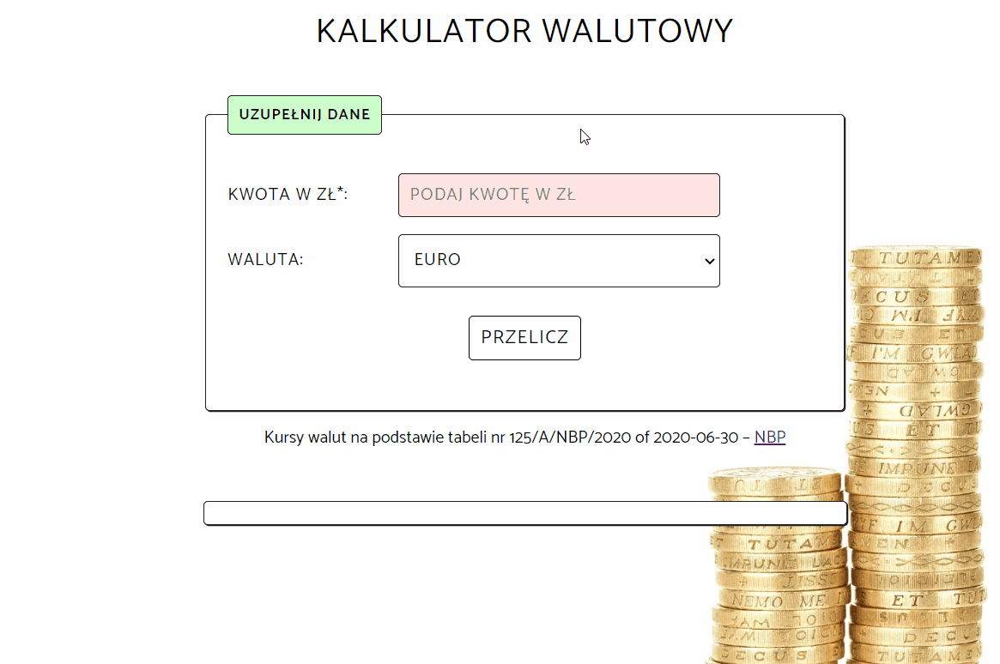

# Currency Converter

## Demo

https://kacperszemraj.github.io/currency-converter/

## Description

This is a simple currency converter designed for educational purposes. It currently uses pre-declared exchange rates.

## How to use

1. Enter the amount in the required field
2. Select the currency into which you want to convert
3. Click on the button "Przelicz"
4. The converted amount will be displayed below

## Technologies

- HTML
- CSS
- JavaScript

## Methodologies

- BEM
